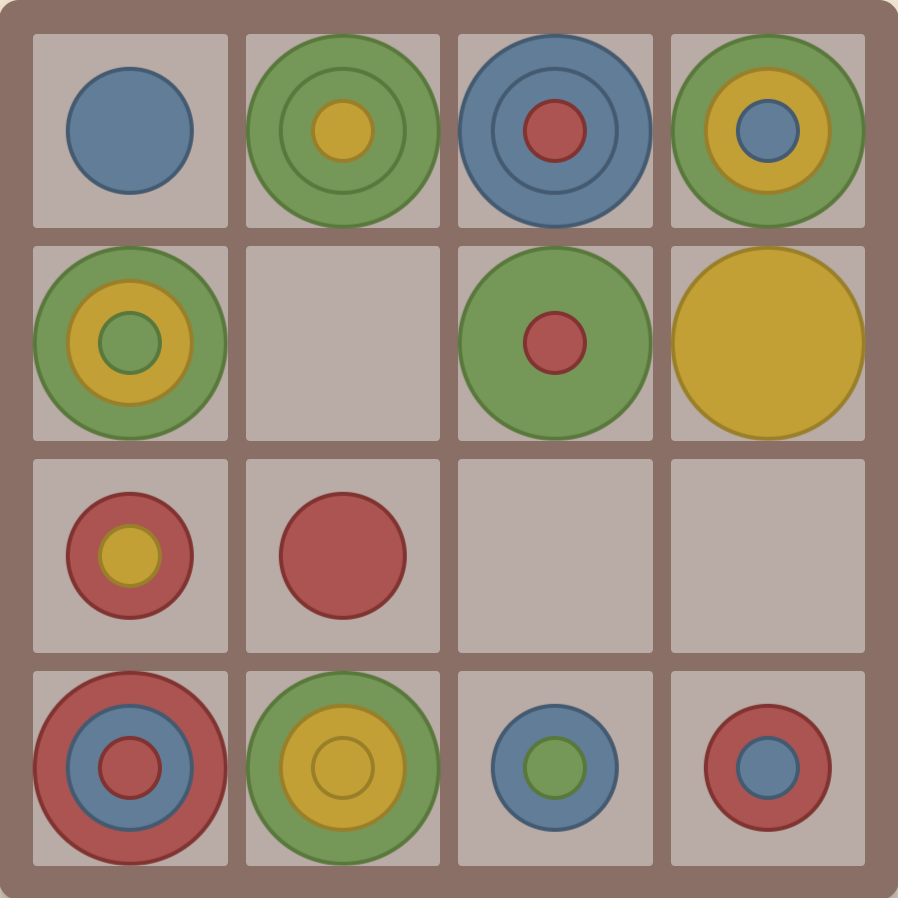

# CircleTactics

<p align="center">
  
</p>

<p align="center">
  <strong>○×ゲームを進化させた、戦略的4人対戦ボードゲーム</strong><br>
  <em>A strategic 4-player board game evolved from Tic-Tac-Toe</em>
</p>

<p align="center">
  <a href="#features">機能</a> •
  <a href="#rules">ルール</a> •
  <a href="#tech-stack">技術スタック</a> •
  <a href="#getting-started">セットアップ</a>
</p>

---

## 概要 | Overview

**CircleTactics** は、古典的な○×ゲーム（Tic-Tac-Toe）に革新的なルールを追加した戦略ボードゲームです。

従来の2人対戦・3×3マスの単純なゲームから、**4人対戦**・**4×4マス**・**3サイズのコマ**・**2種類の勝利条件**という要素を加え、より奥深い駆け引きと戦略性を実現しました。

**CircleTactics** is a strategic board game that adds innovative rules to the classic Tic-Tac-Toe. With 4-player battles, a 4×4 board, 3-sized pieces, and 2 victory conditions, it offers deeper strategy and gameplay.

---

## プレイ画像 | Play Screen

<p align="center">
  
</p>

---

<h2 id="features">機能一覧 | Features</h2>

### ゲームプレイ
- 🎮 **4人対戦モード** - RED（プレイヤー）vs BLUE, YELLOW, GREEN（AI）
- 🧠 **戦略的AI** - 3段階の優先度アルゴリズムで思考するAI対戦相手
- 🏆 **2種類の勝利条件** - マス内勝利 & ボード勝利
- 🎨 **3サイズのコマ** - SMALL / MEDIUM / LARGE

### ユーザー体験
- ✨ **勝利演出** - 紙吹雪アニメーションで勝利を祝福
- 📱 **レスポンシブデザイン** - PC・タブレット・スマートフォン対応
- 🎯 **直感的なUI** - クリック/タップで簡単操作
- 🔄 **ゲーム再開機能** - いつでも新しいゲームを開始可能

---

<h2 id="rules">ゲームルール | Game Rules</h2>

### プレイヤーとコマ

| プレイヤー | 操作 | コマ数 |
|-----------|------|--------|
| 🔴 RED | あなた | 各サイズ5個 × 3 = 15個 |
| 🔵 BLUE | AI | 各サイズ5個 × 3 = 15個 |
| 🟡 YELLOW | AI | 各サイズ5個 × 3 = 15個 |
| 🟢 GREEN | AI | 各サイズ5個 × 3 = 15個 |

### コマのサイズ

```
LARGE   ●●● (大)
MEDIUM  ●●  (中)
SMALL   ●   (小)
```

### 勝利条件

**① Cell Win（マス内勝利）**
> 1つのマス内に、同じプレイヤーの3サイズ全て（小・中・大）が揃う

**② Board Win（ボード勝利）**
> 盤面全体で、4つのマスが縦・横・斜めのいずれかに一列に揃う

### ゲームの流れ

```
1. ランダムなプレイヤーからスタート
2. コマのサイズを選択（SMALL / MEDIUM / LARGE）
3. 4×4盤面のマスをクリックして配置
4. 次のプレイヤーのターンへ（RED → BLUE → YELLOW → GREEN → ...）
5. 勝利条件を満たしたプレイヤーの勝ち！
```

---

<h2 id="tech-stack">技術スタック | Tech Stack</h2>

| カテゴリ | 技術 |
|---------|------|
| **フレームワーク** | React 18 |
| **言語** | TypeScript 5 |
| **ビルドツール** | Vite 7 |
| **スタイリング** | CSS Modules + CSS Custom Properties |
| **状態管理** | React useReducer |
| **デプロイ** | AWS Amplify |
| **リンター** | ESLint |

### アーキテクチャ

```
src/
├── components/     # UIコンポーネント
│   ├── Game.tsx           # ゲーム全体の管理
│   ├── Board.tsx          # 4×4盤面
│   ├── Cell.tsx           # 個別セル
│   ├── Piece.tsx          # コマ表示
│   ├── PlayerHand.tsx     # プレイヤーの手札
│   └── OpponentHandsSummary.tsx  # AI手札表示
├── logic/          # ゲームロジック
│   ├── gameReducer.ts     # 状態管理
│   ├── winConditions.ts   # 勝利判定
│   └── ai.ts              # AI思考エンジン
└── types/          # 型定義
    └── index.ts
```

---

<h2 id="getting-started">セットアップ | Getting Started</h2>

### 必要な環境

- Node.js 18.0.0 以上
- npm または yarn

### インストール手順

```bash
# 1. リポジトリをクローン
git clone https://github.com/your-username/CircleTactics.git

# 2. ディレクトリに移動
cd CircleTactics

# 3. 依存関係をインストール
npm install

# 4. 開発サーバーを起動
npm run dev
```

開発サーバーが起動したら、ブラウザで `http://localhost:5173` にアクセスしてください。

### 利用可能なスクリプト

| コマンド | 説明 |
|----------|------|
| `npm run dev` | 開発サーバーを起動 |
| `npm run build` | 本番用ビルドを生成 |
| `npm run preview` | ビルド結果をプレビュー |
| `npm run lint` | ESLintでコードをチェック |

---

<p align="center">
  Made with ❤️ using React + TypeScript + Vite
</p>
